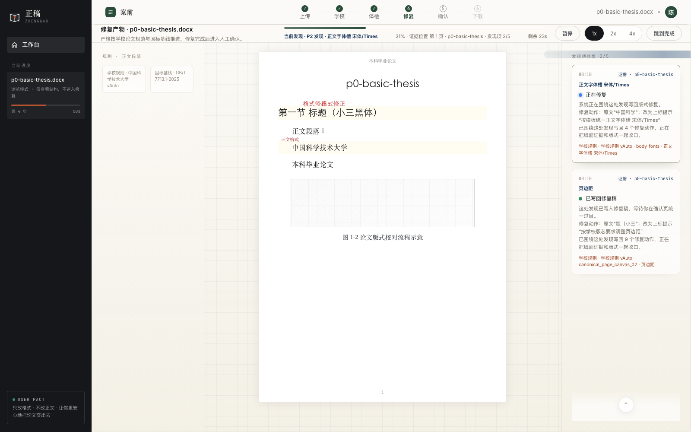

# Paper Formatter · 正稿

AI Agent 驱动的论文排版修复工作台。系统围绕「上传论文 → 选择学校规则 → 体检发现项 → 自动修复 → 人工确认 → 下载定稿」构建，目标是把已经写好的论文，按学校规则与 GB/T 7713.1 基线透明地检查、修复、确认并导出。

> 核心原则：只修排版与格式，不改正文语义；所有修改都保留证据，并在最终确认页由用户点头。

## 当前产品形态

| 能力 | 说明 |
|---|---|
| Word 排版修复 | 上传 `.docx`，生成修正版 Word，保留原文语义 |
| PDF 格式检测 | 上传 `.pdf`，生成格式检测报告，不直接修改 PDF |
| 学校规则识别 | 根据文档封面、文件名和规则包别名识别学校规范 |
| Finding 工作台 | 以发现项为业务事实，不以页码作为主状态 |
| 修复现场 | Step4 展示当前正在修什么、为什么修、修到哪里 |
| 最终确认 | Step5 汇总所有修复项，支持接受、拒绝、自改、下载守门 |
| 规则落表 | 学校规则、规则快照、检测命中与下载门禁逐步表结构化 |

## 修复现场预览

Step4 不是后台日志页，而是论文修复现场：中间展示真实纸面定位，右侧解释当前发现项、证据与写回状态，顶部进度与 finding 同源推进。



## 产品主线

```text
Step1 上传
  └─ Word 排版修复 / PDF 格式检测
Step2 学校规则
  └─ 官方规则优先，待补规则显式标识
Step3 体检发现
  └─ 生成 Finding，展示规则依据与证据
Step4 自动修复
  └─ 论文修复现场：当前动作、纸面定位、证据与安全说明
Step5 人工确认
  └─ 逐项确认修改，下载前受 Finding Guard 约束
Step6 下载定稿
  └─ 仅在修复任务与确认状态满足条件后开放
```

## 架构基线

Paper Formatter 不是普通 PDF/Word 阅读器，而是 finding-centric 的论文格式修复系统。

- **Finding 是业务事实**：`finding_id` 是 Step3/Step4/Step5 的主线，页码只是定位容器。
- **规则与证据优先**：学校规则、GB 标准、对象锚点、规则快照共同构成判断依据。
- **DOCX 是主要编辑载体**：Word 文档用于真实写回；PDF 当前定位为检测与报告能力。
- **安全修复**：格式化器只调整格式属性，内容级 integrity checker 用于发现文本语义风险。
- **下载守门**：未完成修复、未确认 finding、任务类型不匹配时，不允许直接下载。

## 代码结构

```text
ai-agent-lab/
├── paper-formatter/
│   ├── services/
│   │   ├── client/            # React + Vite 前端工作台
│   │   ├── api-gateway/       # TypeScript API、任务编排、规则检测
│   │   └── docx-parser/       # Python DOCX 解析与格式化入口
│   ├── packages/
│   │   └── shared-types/      # 跨端共享 DTO / Finding / Guard 类型
│   ├── docs/                  # 架构、API、审计、规则与部署文档
│   ├── deploy/                # Nginx、systemd、部署脚本
│   └── .github/workflows/     # 行为测试、视觉基线、回归 CI
├── docs/agent-os/             # Agent OS 协作协议与架构
└── AGENTS.md                  # 本仓库 Agent 执行规范
```

## 技术栈

| 层 | 技术 | 职责 |
|---|---|---|
| Client | React 19 / Vite / Playwright | 六步工作台、finding 联动、视觉回归 |
| API Gateway | Node.js / TypeScript / Express | 文档、规则、任务、finding、下载守门 |
| Parser / Formatter | Python / python-docx / XML extractor | DOCX 结构解析、对象图、格式写回 |
| Storage | PostgreSQL / MinIO | 文档元数据、规则集、产物、任务结果 |
| Cache / Queue | Redis optional | 异步任务与轮询优化 |
| Deployment | Nginx / Certbot / systemd | 轻量服务器前后端一体部署 |

## 本地运行

```bash
# API Gateway
cd paper-formatter/services/api-gateway
npm install
npm run dev

# Client
cd ../client
npm install
npm run dev
```

默认本地入口：

- Client: `http://localhost:5173`
- API: `http://localhost:4000/api/v1`
- Health: `http://localhost:4000/api/v1/health`

## 常用验证

```bash
# API Gateway
cd paper-formatter/services/api-gateway
npm run build
npm test

# Client
cd paper-formatter/services/client
npm run typecheck
npm run test:behavior -- --reporter=line
npm run test:visual
```

## 关键文档

- [系统架构](paper-formatter/docs/system-architecture.md)
- [API 规范](paper-formatter/docs/api-spec.md)
- [数据模型](paper-formatter/docs/data-model.md)
- [部署说明](paper-formatter/docs/deployment.md)
- [论文排版项目 README](paper-formatter/README.md)

## 部署方向

当前目标部署形态：

- 香港轻量服务器，2 核 4G，Ubuntu 22.04
- Nginx + Certbot HTTPS
- 前端静态资源 + API Gateway 一体部署
- PostgreSQL、MinIO、Redis 按服务拆分
- systemd 管理 `api-gateway` / `formatter` / 静态站点

## 项目状态

项目正在从 Demo 形态收敛为可验证、可回归、可部署的论文排版系统。当前重点是：

- 学校规则落表与 canonical ruleId 映射
- Step3/Step4/Step5 的 finding-centric 链路稳定性
- Word object graph、图题/表题/续表识别回归
- Step4 修复现场交互体验与真实写回反馈
- Step6 下载守门与最终产物一致性
